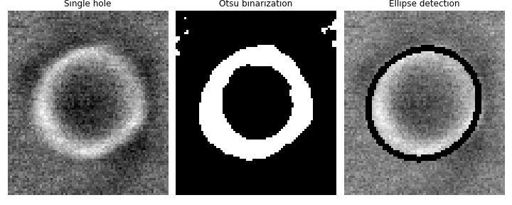
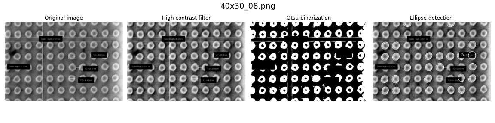
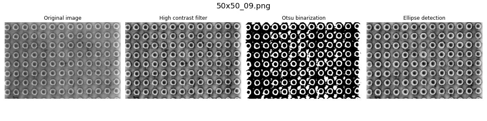
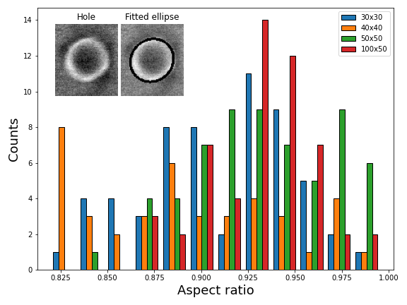
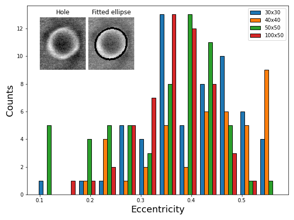

[](https://doi.org/10.5281/zenodo.13886069)
# Manufacturing evaluation via image analysis

Processing of SEM images to evaluate the effectiveness of an optimized fabrication procedure for voltage contacts in SHNOs

### Motivation and background

Fabrication of nanostructures is a delicate procedure with unintended side effects that may hinder the quality of the resulting devices. From resist, to exposure time to quality imaging, a consistent and reliable manufacturing procedure can mean the difference between having merely a dozen or hundred of fully operational architectures to study novel schemes to exploit spin transport. Currently, the team at the ASG is working on a report that compiles the processes to achieve such standarized results for thin film ferromagnetic/heavy metal spin Hall nano-oscillators. 

To aid with that effort, the present repository presents automated analysis of SEM images using the OpenCV image processing module. The purpose is to characterize the consistency of some of the obtained features and show the discussed method's high yield outcome.

### Filtering and fitting
In the notebook [`evaluating-manufacturing-processes.ipynb`](processed-images/evaluating-manufacturing-processes.ipynb), the image processin is shown in detail. The main issue has to do with contouring. The package OpenCV has an excellent countour detection tool (i.e. looking for closed curves of similar colored pixels). The tool might even be too good, by detecting sutile changes in shadows and contrasts, it introduces image artifacts that might be confused with features.  So, proper filtering has to be performed in order to have a high enough contrast that allows us to get rid of the artifacts.

I found that this was most easily achieved by using a high contrast filter, Gaussian bluring and global Otsu binarization. For a single hole image, the contouring is pretty straightforward since there are only two contours of the inner shadow and outer hole. Picking the latter and fitting an ellipse over it, the results are very good.



On bigger arrays, however, one runs into issues handling false positive artifacts and fitting ellipses over them. Mainly, lighting and white normalization mess with the binarization. To deal with this, I introduced other parameters via the function `ellipseFitting`, namely what the expected interval will be for the minor and major axes of the fitted ellipses. Not only this allowed me to filter out unwanted shapes; but, in some cases, also interpolate holes that are partially covered or incomplete.




### Eccentricity and aspect ratio

Given that the original SEM images have different scales of pixel per length, one easy and streamlined way to determine the quality of the intended circles is by determining the degree of 'circleness' the pictures show. After fitting ellipses on top of the contours, the major and minor axes were found and the eccentricity (i.e. how much a conic section deviates from a circle) and the aspect ratio (division of the minor axis length over the major one).


More specifically:

**Eccentricity**

```math
\epsilon = \sqrt{1-\frac{b^2}{a^2}}
```

**Aspect ratio**
```math
r=\frac{b}{a}
```

### Results and some discussion

The eccentricity and aspect ratio for four hole arrays are shown below. 

Aspect ratio               |  Eccentricity
:-------------------------:|:-------------------------:
 | 

We see that the left figure tells a compelling story about the quality of the procedure, since aspect ratios are close to 1, thus confirming the adecuacy of the manufacturing details. The eccentricity, on the other hand, allows us to probe into the 'circleness' with a little more detail. Since the $`\epsilon`$ is not a linear function with the aspect ratio, this means that we can evaluate a shift in curvature from the perfect circle (zero), while still maintaining high accuracy.

# Cite this code
If this code was useful for you, you can help me out by citing it:
'''V. H. González, ‘AkravasTheWise/manufact-eval-img-an: Evaluation of fabrication of voltage-gated spin Hall nano-oscillators’. Zenodo, Oct. 03, 2024. doi: 10.5281/zenodo.13886069'''
